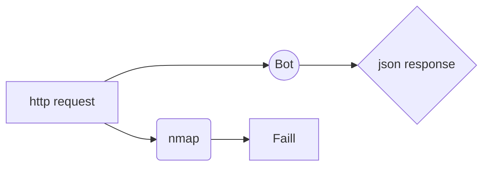
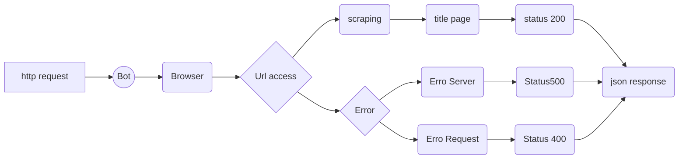

# BotWare-API

Este projeto surgiu como solução para testar acesso remoto a equipamentos de rede(ONUs e Roteadores domesticos).👾

## Proposta do aplicação

* Facilitar o diagnostico de quantidade de equipamentos que estão com acesso remoto habilitado.
* Receber e entregar informações atraves de requisições web.
* Construção escalavel de forma que possa ser adicionada novas funções a aplicação.

### Autor

Willian da Rosa Rodrigues



### Porque não usar Nmap para testar portas de acesso remoto

Passou a ser invalido a possibilidade de teste com o Nmap pelo tempo de demora do scan de portas. Com o bot podemos realizar teste de acesso com usuario e senha (Quase um brut force pois teria que tentar as varias senhas por equipamento)

### Primeiro objetivo

Coletar dados do da tag **title** da pagina para identificar o tipo de equipamento. Resposta a ser entregue:

```javascript

Metodo POST body:

    {
        ip:"192.168.1.1" // Exemplo
    }

Resposta esperada: status 200

    {
        title: "Titulo da pagina",
        status: "Acessivel",
        ip: "192.168.1.1" // Exemplo
    }

Resposta de erro:

    {
        title:"Error",
        status: "inacessível",
        ip:"192.168.1.1" // Exemplo
    }

```

## Fluxo esperado


