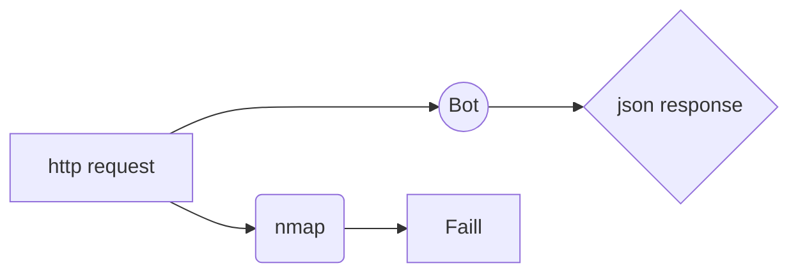

# BotWare-API

Este projeto surgiu como solução para testar acesso remoto a equipamentos de rede(ONUs e Roteadores domesticos).👾

## Proposta do aplicação!
* Facilitar o diagnostico de quantidade de equipamentos que estão com acesso remoto habilitado.
* Receber e entregar informações atraves de requisições web.
* Construção escalavel de forma que possa ser adicionada novas funções a aplicação.

### Autor
Willian da Rosa Rodrigues

Passou a ser invalido a possibilidade de teste com o Nmap pelo tempo de demora do scan de portas. Com o bot podemos realizar teste de acesso com usuario e senha (Quase um brut force pois teria que tentar as varias senhas por equipamento)